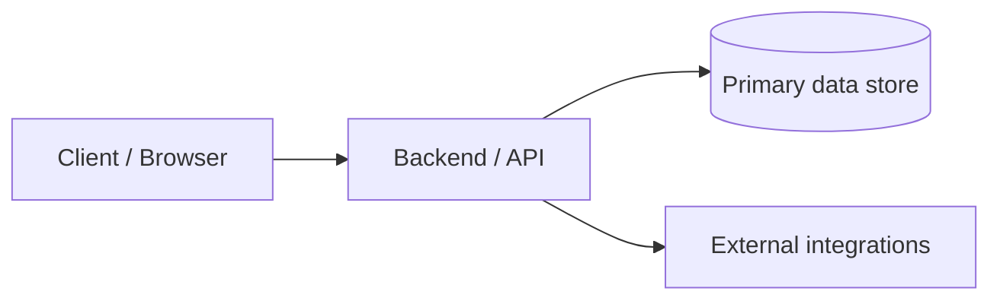

# <Project name>

Short one-line summary of what this system does and who it serves.

---

## Context & role

- **Type**: (product / internal tool / platform / integration)
- **Domain**: (e.g. logistics, fintech, ESG, legal, support)
- **My role**: (e.g. solo engineer / lead / feature owner)
- **Timeline**: (approx. dates or phase)

---

## Problem

- What was broken or missing?
- Who felt the pain (which teams / users)?
- What constraints mattered (time, budget, tech, compliance, legacy)?

Keep this in **plain language** – make it understandable to a smart non-engineer.

---

## Solution

- 3–6 bullets describing what you actually built.
- Call out the key ideas, not every endpoint or screen.
- Mention important trade-offs (e.g. \"opted for batch sync over real-time\" and why).

Example structure:

- Designed and built a multi-tenant backend to…
- Added a focused web portal for…
- Introduced automation around…
- Standardized data/models so that…

---

## Architecture

High-level system shape. Use a Mermaid diagram plus 2–3 lines of explanation.

Explain briefly:

- How requests flow through the system.
- Any notable patterns (queues, background workers, eventing, caching).

---

## Tech stack

| Area        | Technologies                         | Notes                            |
| ---------- | ------------------------------------ | -------------------------------- |
| Frontend   | React, Angular, Tailwind, etc.       | SPA / SSR / forms, etc.         |
| Backend    | Python (FastAPI, Flask), Node, etc.  | Monolith / services, patterns   |
| Data       | Postgres, MySQL, Redis, etc.         | Main data stores                 |
| Infra      | AWS, Docker, Kubernetes, etc.        | Hosting, deployment, observability |
| Tooling    | GitHub Actions, tests, linters, etc. | DX / quality                     |

Tune this table per project; remove unused rows and be specific.

---

## Key challenges & decisions

3–5 bullets that show real engineering thought:

- Why certain technologies or patterns were chosen.
- How you handled performance, reliability, or complexity.
- Any trade-offs (and what you would do differently at a larger scale).

---

## Results & impact

Focus on outcomes, not just features:

- Performance: latency, throughput, or resource usage improvements.
- Reliability: fewer incidents, clearer failure modes, easier recovery.
- Workflow / business: time saved, errors reduced, revenue or pipeline unlocked.

When you can, **quantify** (even roughly) – e.g. \"cut manual reporting time from days to hours\".

---

## What I’d improve next

2–3 bullets that show you think beyond v1:

- Architectural improvements or refinements.
- DX improvements (tests, tooling, automation).
- Features that would compound the existing value.

---

## Links (optional)

- Related repo(s): …
- Public docs or demo (if any): …
- Internal-only details you can safely reference at a high level: …

