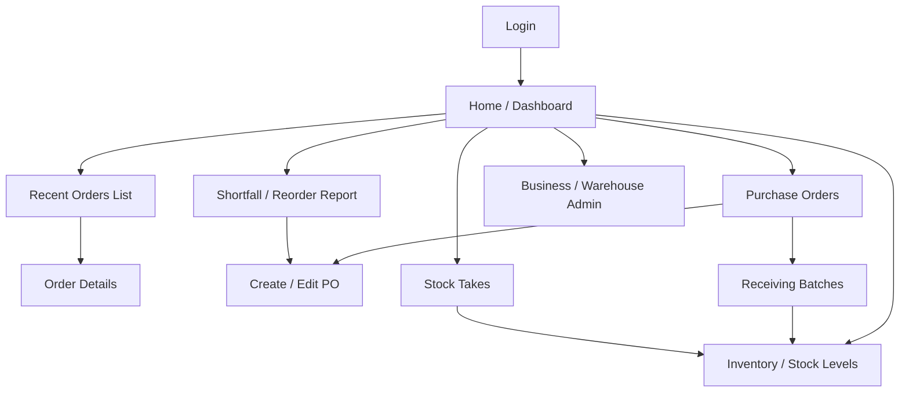
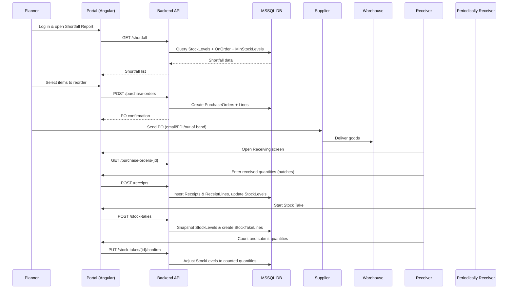

### Problem description

**AllFresh Farmhouse Ordering** is an internal inventory, purchasing, and ordering system for fresh produce businesses. It solves the problem of fragmented spreadsheets and ad‑hoc tools by providing a single source of truth for products, suppliers, purchase orders, receiving (multi‑batch), stock levels, stock takes, and shortfall/reorder planning across multiple business units and a virtual warehouse per unit.

---

### Architecture diagram (Mermaid)

```mermaid
flowchart LR
    subgraph Client
        P[Portal Web App<br/>Angular]
    end

    subgraph Backend
        API[Farmhouse Backend<br/>Python handlers]
    end

    subgraph DB[(MSSQL Database)]
        BU[BusinessUnits]
        WH[Warehouses]
        PROD[Products & ProductItems]
        SUP[Suppliers]
        PO[PurchaseOrders & Lines]
        REC[Receipts & ReceiptLines]
        SL[StockLevels]
        ST[StockTakes & Lines]
        MIN[MinStockLevels]
    end

    P -->|HTTPS / JSON APIs| API
    API --> BU
    API --> WH
    API --> PROD
    API --> SUP
    API --> PO
    API --> REC
    API --> SL
    API --> ST
    API --> MIN

    subgraph Docs
        DOCS[Docusaurus Docs<br/>inventory & purchasing schema]
    end

    DOCS -.-> Devs & Users
```

---

### UI screens (Mermaid)



---

### Workflow (Mermaid)



*(This sequence can be used as the storyboard for a short explainer video: each lifeline and message becomes a scene or animation step.)*

---

### Results / impact

- **Operational accuracy**: Centralized, well‑indexed schema for POs, receipts, stock, and stock takes reduces data entry errors and improves inventory accuracy (less shrinkage and write‑offs).
- **Reduced stockouts & overstock**: Min/target stock levels plus shortfall calculations across on‑hand and on‑order quantities enable proactive reordering and better cash‑flow control.
- **Scalability across business units**: One virtual warehouse per business unit with shared product catalog supports growth into new regions while keeping data properly isolated.
- **Improved visibility & decision‑making**: Portal screens for recent orders, inventory, receiving, and stock takes give managers real‑time insight into supply chain status, enabling faster responses to demand or supplier issues.

