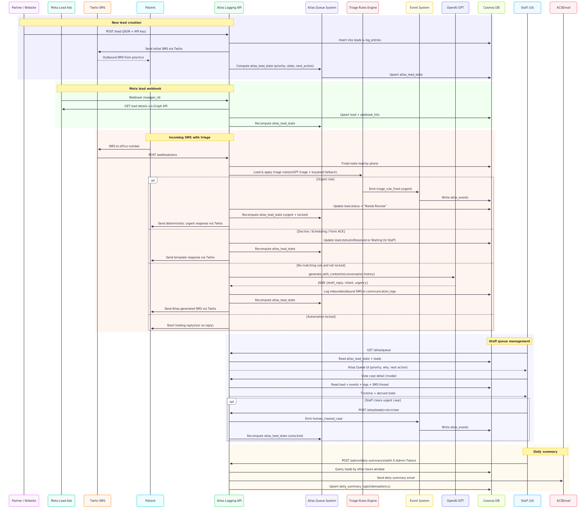

### Problem description

**Atlas Logging API** is a Flask-based service that ingests and manages patient leads and SMS conversations for a medical practice.
It centralizes data in Azure Cosmos DB, uses OpenAI to generate safe SMS replies, Twilio for messaging, and an Atlas work queue plus triage rules engine to:

- **Ingest leads** from website/partners/Meta and unify them into a single lead record.
- **Automate SMS conversations** while safely escalating urgent cases and honoring declines.
- **Prioritize staff work** with a derived queue (priority, state, next action, “why Atlas chose this”).
- **Provide auditability** via communication logs, event stream, and daily summary emails.

---

### Architecture diagram

  

---

### UI screens

  

---

### Workflow

  

---

### Results / impact

- **Reduced missed urgent cases**: Urgent triage rules plus an event-driven automation lock ensure potentially dangerous messages are immediately surfaced and not auto-replied by AI.
- **Higher staff efficiency**: The Atlas work queue compresses multi-table data (leads, SMS, events, logs) into a single prioritized list with “why” explanations and concrete next actions.
- **Consistent patient communication**: OpenAI-backed SMS replies, templated responses for key scenarios, and audit logs in `communication_logs` standardize tone and reduce manual drafting.
- **Better visibility and reporting**: Per-lead timelines, summary endpoints, and daily summary emails give operators a clear picture of volume, status, and outcomes across channels.
