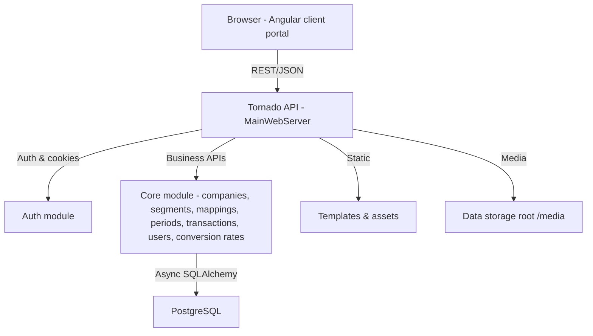
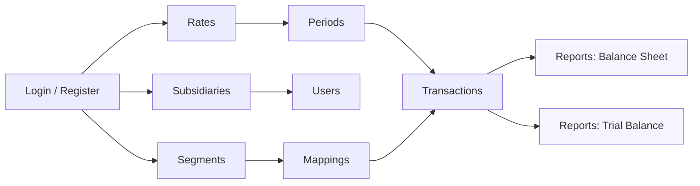

## Problem description

- Multi-entity finance teams need to consolidate subsidiaries into a parent, align charts of accounts, manage FX, and produce trial balance/balance sheet views with proper posting/reversal controls.
- They need secure self-service onboarding (parent + child companies), segment-driven charts of accounts, mapping between local and consolidation accounts, and auditable transaction workflows.

---

## Architecture (Mermaid)



---

## UI Screens (Mermaid)



---

## Workflow (Mermaid)

```mermaid
flowchart TD
    A[Authenticate / Register] --> B[Create Parent & Subsidiaries]
    B --> C[Auto-create account/reporting segments]
    C --> D[Load currencies & set conversion rates]
    D --> E[Define mappings\n(child to parent segments/accounts)]
    E --> F[Open periods/subperiods]
    F --> G[Capture/Import transactions & entries]
    G --> H[Post or reverse transactions]
    H --> I[Run reports\n(Balance Sheet, Trial Balance)]
    I --> J[Export / Share]
```

(If you need a video, I can script it next—providing the mermaid diagram for now.)

---

## Results / Impact

- Faster onboarding: parent + child companies scaffolded with default segments and users.
- Reduced reconciliation time via enforced mappings between local and consolidation segments.
- FX-ready numbers through managed conversion rates per company/currency/date.
- Auditability: posting/reversal flags, creator/updater tracking, and secure cookie/RSA-based auth.
- Decision-ready reports: balance sheet and trial balance views aligned to the consolidated chart.

