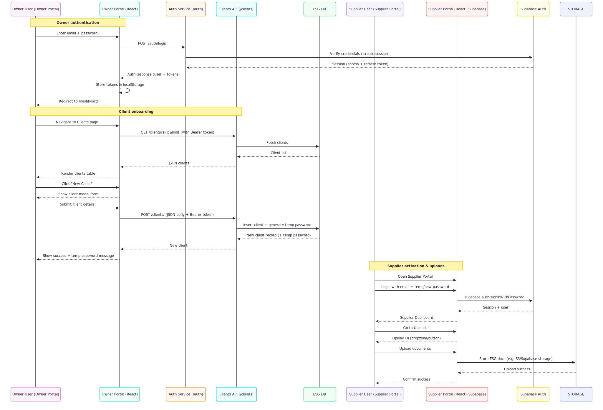

### Problem description

**Problem**: ESG (Environmental, Social, Governance) reporting and supplier engagement are fragmented across spreadsheets, emails, and ad‑hoc tools, making it hard for an “owner” organization to onboard clients, manage supplier accounts, and collect documentation consistently.

**Solution**: A two‑sided ESG platform with an **Owner Portal** for client onboarding and management (including authentication and client lifecycle) and a **Supplier Portal** for authenticated suppliers to log in, view a dashboard, and upload required ESG documents, backed by a shared API/auth layer and data store.

---

### Architecture diagram

  

---

### UI screens

  

---

### Workflow

  

---

### Results / impact

- **Operational efficiency**: Centralizes client onboarding and supplier access, reducing manual spreadsheet/email workflows and improving data consistency.
- **Data quality & traceability**: Structured client records and authenticated supplier uploads create a single source of truth for ESG‑related information and documents.
- **Security & access control**: Token‑based auth for owners and Supabase auth for suppliers ensure only authorized parties can see or modify ESG data.
- **Scalability**: Clear separation of frontends (owner/supplier), backend APIs, and storage enables incremental extension (e.g. more ESG metrics, reporting, analytics) without re‑architecting the core system.
