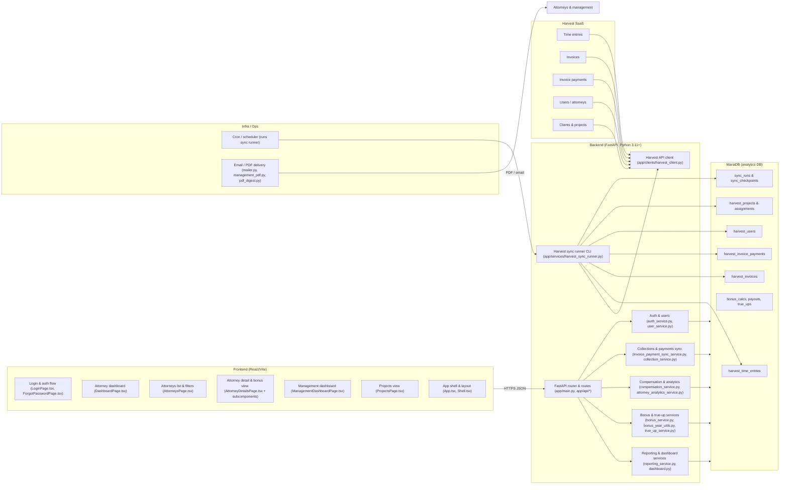
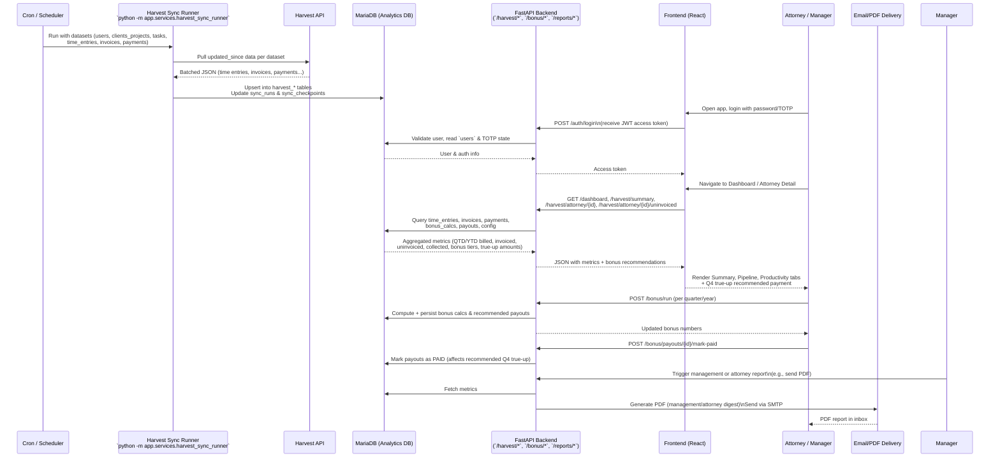

### Problem description

Harvest Reporting MVP is a reporting and compensation tool for law firms that use Harvest for time tracking. The core problem it solves is that Harvest’s native reports don’t answer key questions for firm leadership and attorneys:

- **For attorneys**: How am I tracking against my quarterly and annual bonus targets (billable, invoiced, and collected)? How much potential bonus is “locked” in uninvoiced or uncollected work?
- **For management**: Where is revenue stuck in the pipeline (uninvoiced / uncollected, by client and project, with aging)? Which attorneys are on/off pace for targets? How do we generate consistent PDF/summary reports for attorneys and leadership?
- **For operations**: How do we keep an internal analytics database incrementally synced with Harvest (time entries, invoices, payments, users, projects) in a robust, observable way?

The MVP introduces a dedicated backend that syncs Harvest data into a MariaDB warehouse, exposes higher-level reporting and bonus/true‑up calculations, and a front‑end that surfaces dashboards for attorneys and management.

---

### Architecture diagram (mermaid)



---

### UI screens (mermaid diagram)

This focuses on the main screens and key data they surface, aligned with your `h1` spec (Summary, Revenue Pipeline & Aging, Time & Productivity) and existing React pages.

```mermaid
flowchart TD
    START[Login Screen\nEmail + Password + TOTP]
    FORGOT[Forgot Password\nReset Request]
    DASH[Attorney Dashboard\nTab 1 - Summary]
    PIPELINE[Revenue Pipeline & Aging\nTab 2]
    PRODUCTIVITY[Time & Productivity\nTab 3]
    ATTYS[Attorneys List\n(firm-wide view)]
    ATTY_DETAIL[Attorney Detail Screen\nQTD/YTD, Bonus, Uninvoiced, Collections]
    BONUS_SEC[Bonus Dashboard & Q4 True-up Card]
    MGMT[Management Dashboard\nFirm-wide KPIs]
    PROJ[Projects / Clients View]

    START -->|Forgot password?| FORGOT
    START -->|Successful login| DASH

    DASH -->|Tab: Revenue pipeline & aging| PIPELINE
    DASH -->|Tab: Time & productivity| PRODUCTIVITY

    DASH -->|View all attorneys| ATTYS
    ATTYS -->|Select attorney| ATTY_DETAIL

    ATTY_DETAIL --> BONUS_SEC
    ATTY_DETAIL --> PIPELINE
    ATTY_DETAIL --> PRODUCTIVITY

    DASH -->|Mgmt role| MGMT
    MGMT --> PROJ

    %% Dash content (Summary)
    subgraph Summary_Cards["Attorney Dashboard - Summary (Tab 1)"]
        QTD[QTD: Billed / Invoiced / Not Invoiced\n+ Collected / Not Collected]
        BONUS_QTD[QTD Bonus Card\n- Actual vs Target\n- Pace to threshold\n- Estimated quarterly bonus\n- Bonus locked in Not Invoiced]
        YTD[YTD: Billed / Invoiced / Not Invoiced\n+ Collected / Not Collected]
        BONUS_YTD[YTD Bonus Card\n- Actual vs Target (2x salary)\n- % to yearly threshold\n- Estimated yearly bonus\n- Bonus locked in Not Invoiced / Not Collected]
    end

    DASH --> Summary_Cards
```

---

### Workflow (mermaid diagram)

This shows the end‑to‑end flow from Harvest to dashboards/bonus calculations and PDFs.



---

### Results / impact

- **Transparency for attorneys**: Each attorney gets a clear QTD and YTD view of billed, invoiced, uninvoiced, collected, and not collected work, plus how much bonus is locked in each stage of the pipeline.
- **Actionable revenue pipeline**: Management sees aging of uninvoiced and uncollected amounts by client/project, helping prioritize invoicing and collections to unlock revenue and bonuses.
- **Robust, incremental sync from Harvest**: A dedicated sync runner uses checkpoints and structured logging to keep a MariaDB analytics store current, enabling all dashboards and reports to read from a single, consistent source of truth.
- **Bonus & true-up automation**: Quarterly and annual bonus tiers, Q4 true-up calculations, and recommended payment amounts are computed from actual collections and prior payouts, reducing manual spreadsheet work and payment errors.

