### Problem description

**Instamove** is a property rental platform focused on London that helps renters discover rooms, flatshares, and full properties while giving landlords a self‑service way to create, promote, and manage listings. It solves the problem of fragmented, generic rental search by combining granular filters (price, room type, area, amenities, commute time), lifestyle “house vibes”, and in‑app messaging/booking into a single, data‑driven marketplace with SEO‑optimized, location‑aware discovery.

---

### Architecture diagram

  

---

### UI screens

  

---

### Workflow

  

---

### Results / impact

- **For renters**: Faster discovery of relevant rentals in London via commute-aware search, lifestyle filters, and surfaced “most popular” listings, reducing time and friction to find a room or flatshare.
- **For landlords**: Self‑serve listing, premium promotion, and performance analytics (views, saves, messages, calls) help maximize occupancy and justify marketing spend without relying on agents.
- **For the business**: SEO‑optimized landing paths, deep area coverage, and paid premium/boosted listings generate recurring revenue while building defensible search traffic and a rich dataset of demand and pricing signals.
