### Problem description

**Business problem**

- **Need**: Automatically generate realistic web traffic and sign‑ups for multiple client sites, while tracking detailed activity and enforcing per‑site limits.
- **Context**:
  - Each client has one or more landing pages.
  - For each page, you want controlled numbers of **visits** and **form signups** per day.
  - Traffic must look human (scrolls, key presses, delays, varied user agents, time windows, proxies, etc.).
  - Operators need a **web UI + API** to configure sites, landing pages, selectors, and monitor actions.
- **Solution**:
  - A **core traffic service** (`TrafficService`) that uses Selenium (with Bright Data proxies, stealth, and anti‑captcha) to visit pages and submit forms based on database configuration.
  - A **Tornado web/API server** that exposes CRUD endpoints and a portal UI for managing sites, pages, selectors, users, and dashboards.
  - A **MySQL database** storing configuration and logs (`Site`, `LandingPage`, `PageSelector`, `SiteRecord`, `Action`, `User`, etc.).

---

### Architecture diagram

  

---

### UI screens

  

**Screen purposes (brief)**
- **Login**: Authenticate operators into the portal.
- **Dashboard**: High‑level counts (visits, signups, success/failure, per‑site summary).
- **Sites List / Detail**: Configure sites, concurrency, visit/signup limits, delay/time windows.
- **Landing Page Selectors**: Configure CSS/XPath selectors for inputs, checkboxes, buttons, headings.
- **Site Records**: Inspect/import the raw lead data (`SiteRecord`) used for form fills.
- **Actions Log**: Detailed history of automated actions (time spent, activity count, status, metadata).
- **Users / Settings**: Access control, keys, base URL, logging level, etc.

---

### Workflow

  

---

### Results / impact

- **Controlled, human‑like traffic generation**
  - Configurable **daily caps** and **time windows** per site via `HasDailyLimit`, `CheckForLimit`, `LastVisit` updates.
  - Random delays, scrolling, key presses, mouse movement, window sizes, user agents, and proxies make sessions appear organic.

- **Automated signup completion and lead tracking**
  - **Form filling** driven by `PageSelector` definitions and `SiteRecord` data, with retries and error logging.
  - Each action is captured as an `Action` with **time spent**, **activity count**, and rich metadata, enabling deep analytics.

- **Operational visibility and control**
  - Systemd services (`scrapper-core-service.service`, `kore-outreach-service.service`, `kor-acast-service.service`) give ops a robust way to start/stop/restart and tail logs.
  - The web portal and API provide a central place to manage sites, view activity, and adjust configuration without touching code.

- **Business impact**
  - Reduces manual effort to test, warm up, or drive traffic to marketing funnels.
  - Provides consistent data (visits, signups, time on page, success/failure reasons) to optimize pages and campaigns over time.

If you’d like, I can now refine these into a slide‑ready outline (e.g., one slide per section) or expand the UI and workflow diagrams for a more detailed presentation deck.

### Problem description

**Business problem**

- **Need**: Automatically generate realistic web traffic and sign‑ups for multiple client sites, while tracking detailed activity and enforcing per‑site limits.
- **Context**:
  - Each client has one or more landing pages.
  - For each page, you want controlled numbers of **visits** and **form signups** per day.
  - Traffic must look human (scrolls, key presses, delays, varied user agents, time windows, proxies, etc.).
  - Operators need a **web UI + API** to configure sites, landing pages, selectors, and monitor actions.
- **Solution**:
  - A **core traffic service** (`TrafficService`) that uses Selenium (with Bright Data proxies, stealth, and anti‑captcha) to visit pages and submit forms based on database configuration.
  - A **Tornado web/API server** that exposes CRUD endpoints and a portal UI for managing sites, pages, selectors, users, and dashboards.
  - A **MySQL database** storing configuration and logs (`Site`, `LandingPage`, `PageSelector`, `SiteRecord`, `Action`, `User`, etc.).

---

### Architecture diagram

---

### UI screens

**Screen purposes (brief)**
- **Login**: Authenticate operators into the portal.
- **Dashboard**: High‑level counts (visits, signups, success/failure, per‑site summary).
- **Sites List / Detail**: Configure sites, concurrency, visit/signup limits, delay/time windows.
- **Landing Page Selectors**: Configure CSS/XPath selectors for inputs, checkboxes, buttons, headings.
- **Site Records**: Inspect/import the raw lead data (`SiteRecord`) used for form fills.
- **Actions Log**: Detailed history of automated actions (time spent, activity count, status, metadata).
- **Users / Settings**: Access control, keys, base URL, logging level, etc.

---

### Workflow

If you want a **video-style workflow**, this sequence is the storyboard: each step (configure → schedule → browse → submit → log → dashboard) can be turned into a short clip or slide, with arrows matching this diagram.

---

### Results / impact

- **Controlled, human‑like traffic generation**
  - Configurable **daily caps** and **time windows** per site via `HasDailyLimit`, `CheckForLimit`, `LastVisit` updates.
  - Random delays, scrolling, key presses, mouse movement, window sizes, user agents, and proxies make sessions appear organic.

- **Automated signup completion and lead tracking**
  - **Form filling** driven by `PageSelector` definitions and `SiteRecord` data, with retries and error logging.
  - Each action is captured as an `Action` with **time spent**, **activity count**, and rich metadata, enabling deep analytics.

- **Operational visibility and control**
  - Systemd services (`scrapper-core-service.service`, `kore-outreach.service`, `kor-acast-service.service`) give ops a robust way to start/stop/restart and tail logs.
  - The web portal and API provide a central place to manage sites, view activity, and adjust configuration without touching code.

- **Business impact**
  - Reduces manual effort to test, warm up, or drive traffic to marketing funnels.
  - Provides consistent data (visits, signups, time on page, success/failure reasons) to optimize pages and campaigns over time.

If you’d like, I can now refine these into a slide‑ready outline (e.g., one slide per section) or expand the UI and workflow diagrams for a more detailed presentation deck.
