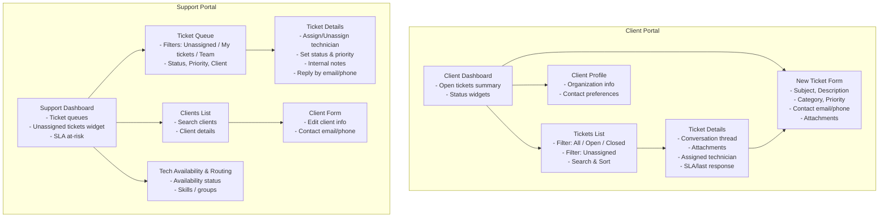
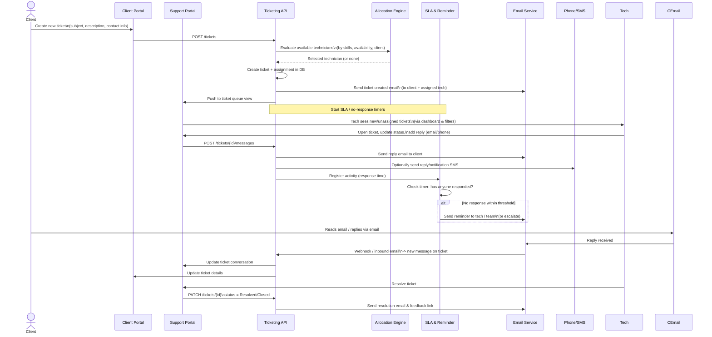

## Problem description

The project is a **ticketing and support system** for managing client issues across multiple portals (client and support). It aims to:

- **Centralize client requests** into tickets instead of ad‑hoc emails/calls.
- **Track technician availability** and **allocate techs** to client tickets efficiently.
- **Ensure no ticket is left unattended**, with automatic email notifications if no one responds.
- **Enable omni‑channel responses**, allowing ticket replies via email and phone.
- **Capture and maintain accurate contact information** for both clients and technicians (email and phone) to support these workflows.

Overall, it reduces response delays, makes ownership clear, and provides a consistent, auditable support experience.

---

## Architecture diagram (mermaid)

```mermaid
flowchart LR
    subgraph Clients
        CWeb[Client Portal (Angular)]
        CEmail[Client Email]
        CPhone[Client Phone Call]
    end

    subgraph Support
        SWeb[Support Portal (Angular)]
        Techs[Support Technicians]
    end

    subgraph Backend["Ticketing Web Server"]
        API[REST/GraphQL API]
        Auth[Auth & Roles]
        Tickets[Ticket Service]
        Users[User & Contact Service]
        Alloc[Tech Allocation Engine]
        SLA[SLA & Reminder Engine]
        Msg[Message Composer]
        DB[(Relational DB\nTickets, Users, Messages,\nAssignments, Availability)]
    end

    subgraph Integrations
        EmailSvc[Email Service\n(ticketing-email.service)]
        SMS[Phone/SMS Gateway]
    end

    CWeb -->|Create/View Tickets| API
    SWeb -->|Manage Tickets & Clients| API

    API --> Auth
    API --> Tickets
    API --> Users
    Tickets --> Alloc
    Tickets --> SLA
    Tickets --> Msg
    Alloc --> DB
    Tickets --> DB
    Users --> DB
    SLA --> DB
    Msg --> DB

    SLA -->|Unanswered ticket alerts| EmailSvc
    Msg -->|Ticket replies| EmailSvc
    Msg -->|Ticket replies| SMS

    EmailSvc --> CEmail
    SMS --> CPhone

    Techs <-->|Use Support Portal| SWeb
```

---

## UI screens (mermaid diagram)



---

## Workflow (mermaid)

### End‑to‑end ticket lifecycle



---

## Results / impact

- **Faster response and resolution times**: Automated routing based on technician availability and reminders for unanswered tickets reduce idle time and prevent tickets from “falling through the cracks.”
- **Higher visibility and accountability**: Dashboards for both clients and support teams, plus clear assignment and status, make ownership obvious and support performance measurable.
- **Improved client experience**: Clients can submit and track tickets via the portal and receive consistent updates by email/phone, increasing trust and satisfaction.
- **Operational efficiency**: Centralized ticket and contact data, structured workflows, and integrated email/phone communications reduce manual coordination, duplicated effort, and miscommunication.

